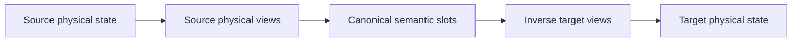

# Neural ABI model

Checkpoint keys locate physical tensors; exported tensor-program use sites establish semantic
roles. NeuralABI therefore links two implementations through canonical slots instead of matching
keys directly.

Canonical decoder weights use `[vocab, hidden]` embeddings, `[heads, head_dim, hidden]` Q/K/V,
`[hidden, heads, head_dim]` attention output, `[intermediate, hidden]` gate/up,
`[hidden, intermediate]` down, and `[hidden]` RMSNorm scales. A physical layout records matrix
orientation, fused component order, optional per-KV-group interleaving, singleton storage axes,
state aliases, and the supporting exported nodes.

The linker composes each source physical decoder with the inverse target physical view. Every
persistent target key must occur in the plan's embedded target schema, as a generated expression or
an explicit alias. Source state must be consumed or accounted for through a physical alias.

Optimizer state is associated with unique parameter identities, not checkpoint-key spelling or
PyTorch optimizer integer IDs. A tied parameter identity may expose several exact model-state keys
but owns one Adam state record. For each target identity, the plan reuses its parameter expression
for the first and second moments; scalar steps and group membership follow explicit fusion/splitting
rules. See [optimizer-state format](optimizer-state-format.md).
